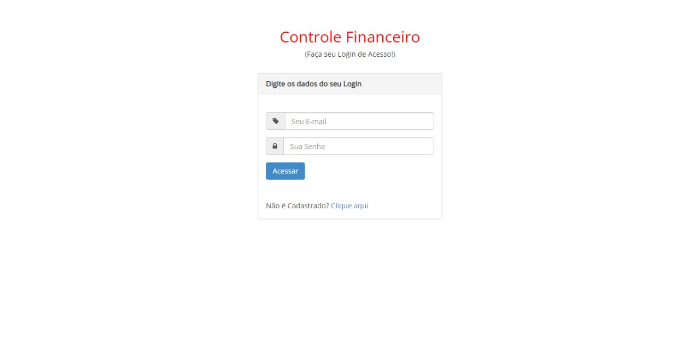
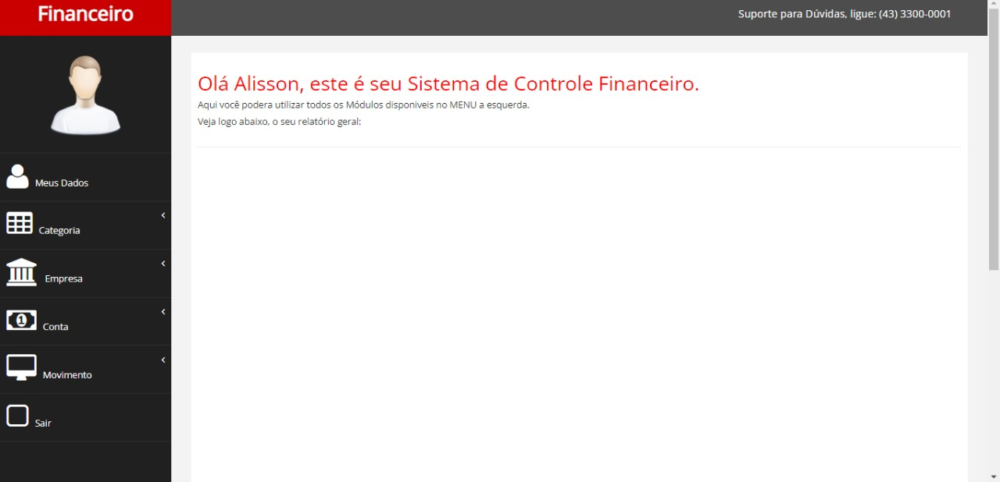
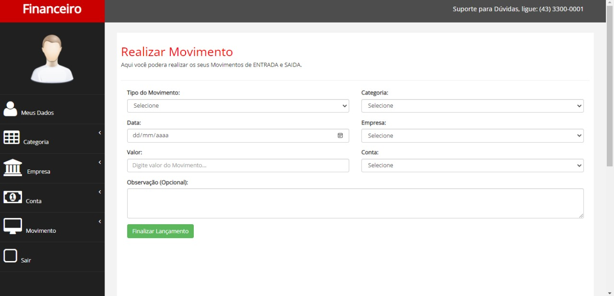
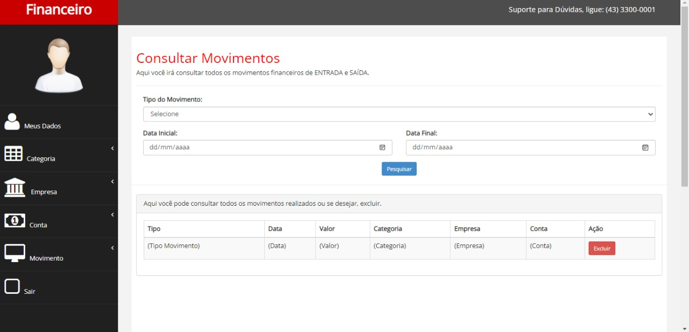

# 💰 Sistema de Controle Financeiro

Intranet de controle financeiro **multiempresa**: cadastro de empresas, contas
e categorias, lançamento de entradas e saídas, e acompanhamento de saldo em
um dashboard — desenvolvido em PHP com MySQL.


## Sobre o projeto

Este projeto nasceu de um curso de PHP Web com Banco de Dados MySQL e foi
usado como exercício prático de modelagem de dados, arquitetura em camadas e
boas práticas de acesso a banco de dados em PHP puro (sem framework).

Cada usuário pode gerenciar **múltiplas empresas**, cada empresa pode ter
várias **contas bancárias**, e cada lançamento financeiro (entrada ou saída)
é vinculado a uma conta, uma empresa e uma categoria — permitindo relatórios
segmentados por qualquer um desses eixos.

## Funcionalidades

- Cadastro e login de usuário, com sessão.
- CRUD completo de Empresas, Contas e Categorias.
- Lançamento de movimentações (entrada/saída) vinculado a empresa, conta e categoria.
- Atualização automática do saldo da conta a cada lançamento, dentro de uma
  **transação de banco de dados** — se algo falhar no meio do processo, tudo
  é revertido (`beginTransaction` / `commit` / `rollBack`).
- Dashboard inicial com total de entradas, total de saídas e últimas 10 movimentações.
- Consulta de movimentações com filtro por tipo e período.

## Screenshots

| Login | Dashboard |
|---|---|
|  |  |

| Novo lançamento | Consulta de movimentações |
|---|---|
|  |  |

Mais telas em [`/prototipos`](./prototipos).

## Arquitetura

O projeto segue o padrão **DAO (Data Access Object)**: uma classe por
entidade, cada uma responsável por suas próprias queries.

```
DAO/
├── Conexao.php      # Conexão PDO com o MySQL (Singleton)
├── UtilDAO.php      # Sessão e autenticação
├── UsuarioDAO.php   # Cadastro, login, dados do usuário
├── EmpresaDAO.php   # CRUD de empresas
├── ContaDAO.php     # CRUD de contas
├── CategoriaDAO.php # CRUD de categorias
└── MovimentoDAO.php # Lançamentos financeiros
```

Todas as queries usam **prepared statements** via PDO (`bindValue`), o que
evita SQL injection. A modelagem de dados foi feita previamente em DER
(disponível em [`/DER`](./DER), arquivo MySQL Workbench).

## Segurança

- Senhas nunca são armazenadas em texto plano: `password_hash()` gera o hash
  no cadastro/alteração, e `password_verify()` valida o login. Essa foi uma
  correção deliberada em relação à versão inicial do projeto (que comparava
  senha em texto plano) — mantida documentada aqui como parte do aprendizado.
- Queries parametrizadas (PDO) em 100% dos acessos ao banco.

## Stack técnica

PHP (PDO) · MySQL · Bootstrap · jQuery · DataTables · Morris.js · Font Awesome

## Como rodar localmente

Pré-requisitos: PHP 7.4+ com a extensão `pdo_mysql`, e um servidor MySQL.

```bash
# 1. Clone o repositório
git clone https://github.com/gustavotanger/ControleFinanceiro.git
cd ControleFinanceiro

# 2. Crie o banco de dados a partir do schema
mysql -u root -p < schema.sql

# 3. Ajuste as credenciais de conexão em DAO/Conexao.php, se necessário
#    (por padrão: host=127.0.0.1, usuario=root, sem senha)

# 4. Suba um servidor PHP embutido a partir da pasta financeiro/
cd financeiro
php -S localhost:8000

# 5. Acesse http://localhost:8000 e crie sua conta pela tela de cadastro
```

## Estrutura do repositório

```
ControleFinanceiro/
├── DAO/            # Camada de acesso a dados
├── DER/             # Modelagem do banco (MySQL Workbench)
├── Script BD/        # Scripts de exemplo de CRUD (fins didáticos)
├── data_base/        # Modelagem adicional
├── financeiro/       # Aplicação (views, assets, index)
├── prototipos/        # Telas/protótipos do sistema
├── schema.sql         # Script de criação do banco (fonte da verdade)
└── README.md
```

> Os arquivos em `Script BD/` são scripts de exemplo produzidos durante o
> curso (fins didáticos de CRUD) e usam dados fictícios; o `schema.sql` na
> raiz é o script de criação recomendado para rodar o projeto.

## Autor

**Gustavo Luciano Tangerino** — [LinkedIn](https://www.linkedin.com/in/gustavo-tanger/)

## Licença

Distribuído sob a licença MIT. Veja [`LICENSE`](./LICENSE) para mais detalhes.
